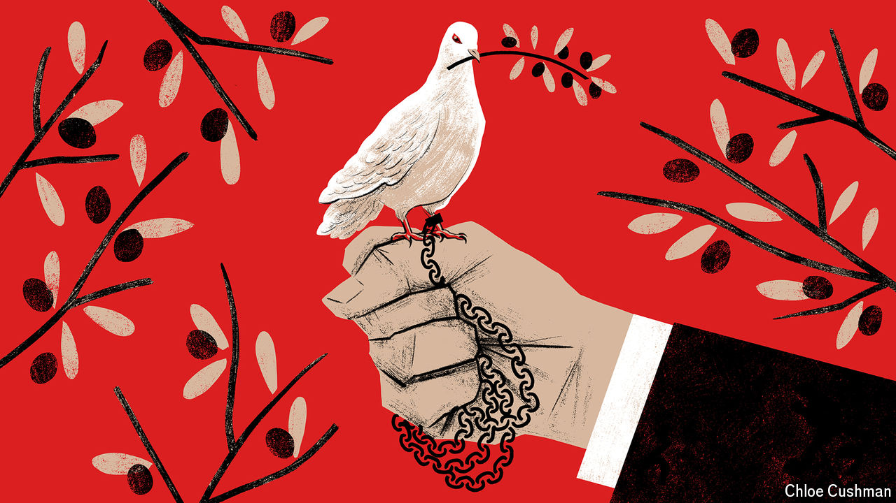

###### Chaguan

# What China means when it says “peace” 

##### From Ukraine to Gaza, China sees a chance to promote an ultra-realist worldview 

 

> Jul 11th 2024 

A SWIFT end to the Ukraine war on Russian terms would fill many governments with a sense of loss. In much of western Europe and beyond, a deal that rewarded Russia for its aggression—exchanging a ceasefire for vast swathes of Ukrainian territory, for instance, or a pledge that Ukraine will never join NATO or any other Western alliance—would feel like appeasement, not peacemaking. A pillar of the post-second-world-war order, involving a refusal to see borders redrawn by force, would have fallen.

China disagrees. For Communist Party bosses in Beijing, a quick Russia-friendly end to the fighting in Ukraine would be grounds for celebration. Most simply, it would humiliate the Biden administration and every power that backs Ukraine, while vindicating China’s confidence that Western unity cannot last. More important, it would offer a glimpse of a future world order which, according to Chinese officials and scholars, already enjoys the support of most governments, notably in the developing world.

