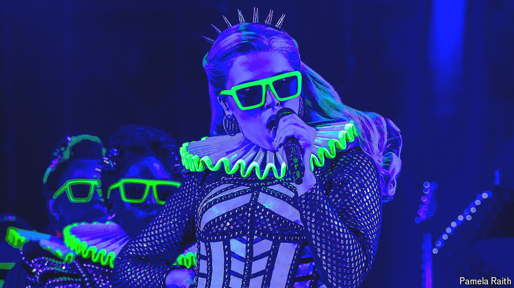

###### Heads will roll

# Henry VIII’s wives get their revenge 

##### New tales resurrect the Tudor queens for modern audiences 

 

> Jul 11th 2024 

Hilary Mantel knew that some stories “compel retelling”. One such tale—imagined in her acclaimed trilogy of “Wolf Hall” novels—is that of Henry VIII, the cultured Renaissance king turned wife-murdering monster. The tale of the English monarch and his six spouses has been retold countless times by novelists, biographers and film-makers. Why is this tribe of  so enthralling?

