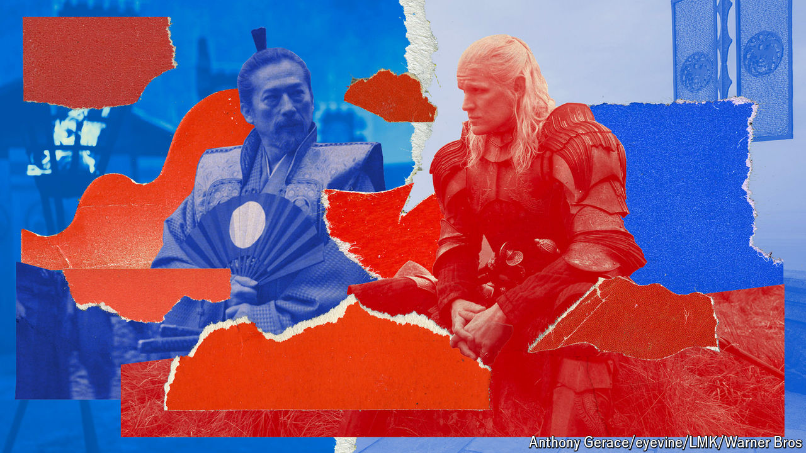

###### Backstabbing blockbusters

# Power-grabbing tips from “House of the Dragon” and “Shogun” 

##### One swords-and-scheming TV show seems more relevant today than the other 

 

> Jul 5th 2024 

Both are big-budget sagas about the ruthless pursuit of power. Both combine exquisite production values with immense popularity. —which started airing its second season on hbo in June—is the third-most “in-demand” television series in the world, according to Parrot Analytics, a data firm. (“Game of Thrones”, its antecedent, still tops the charts despite finishing in 2019.) “Shogun”, released in February and streaming on Hulu and Disney+, is in the top 0.2%. The tens of millions of people who have watched these shows undoubtedly include plenty of politicians, from Washington to Warsaw. This raises an intriguing question: might they learn something? And if so, which of the swords-and-scheming blockbusters offers a better guide to seeking power in real life? 

At first glance, the answer is obvious. The world of “Game of Thrones” is a fantasy. Humans in Westeros ride dragons through the clouds at several hundred miles an hour, a feat that would be impossible even if dragons existed, which they don’t. Enemies are dispatched not in debates or at the ballot box, but via magic shadows, magic disguises and magic minerals. Sometimes they are raised from the dead. Sometimes dragons are raised from the dead, to become zombie dragons. None of these options is available to a politician in the real world. 

“Shogun”, by contrast, is loosely based on actual events. An English ship’s navigator, William Adams, really did wash up in Japan in 1600, and he really was ennobled for helping the Shogun, Tokugawa Ieyasu, build a stronger navy. The television series, like the novel by James Clavell on which it is based, changes the names: Adams becomes John Blackthorne (played by Cosmo Jarvis) and Tokugawa becomes Lord Toranaga (Sanada Hiroyuki). It also exaggerates the Englishman’s role in the warlord’s rise to power. But as historical dramas go, it is fairly true to life. An Englishman in 17th-century Japan would certainly have been astonished by the locals’ elaborate courtesy, superior personal hygiene and impromptu beheadings.

