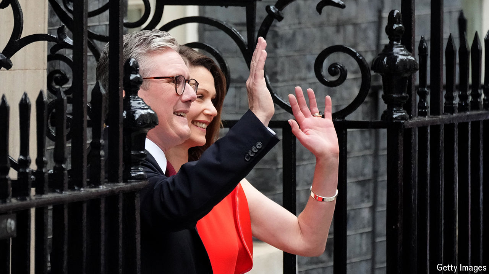

###### Back Story

# The drama of election night: a critical guide 

##### In a bumper year for voting, elections are the top-billing show 

 

> Jul 9th 2024 

A car drives down a road in drizzly central London, taking a besuited man home from a meeting. It is a mundane image, transmuted into spectacle by the alchemy of elections. Tracked in the sort of aerial footage normally reserved for felons on the run, the car conveyed Sir Keir Starmer to Downing Street from Buckingham Palace, where, at the king’s invitation, he became  on July 5th.

Walter Bagehot, a Victorian editor of , divided the constitution into the “efficient” parts (like the cabinet) and the “dignified” or “theatrical” elements (like the monarchy). Election night—the top-billing show in many countries in what is a bumper year for voting—brings the two together. It is a pivotal moment in the life of a nation. But it is also a drama, mixing a high-stakes plot with actorly set pieces and rhetorical motifs.

These days the night’s action begins with an exit poll, which, like a prologue, announces the key themes. Sometimes the findings are predictable, as with the thumping of the Conservatives foretold by  in Britain. Sometimes this opening scene is electrifying. In France the preliminary results of parliamentary elections flash up on TV after a ten-to-one countdown; on July 7th they landed with a boom, showing Marine Le Pen’s hard-right National Rally surprisingly  into third place.

