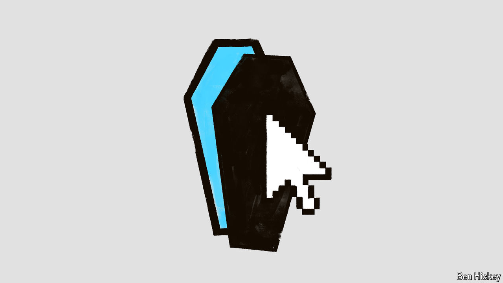

###### A date with destiny and your data

# What happens to your data when you die? 

##### An individual’s digital footprint will long outlive them. That presents many quandaries 

 

> Jul 10th 2024 

By Carl Ohman. 

FRANZ KAFKA  in literary obscurity. He had instructed his friend  to burn his unpublished works. Fortunately for generations of readers, Brod did not; he believed Kafka to be among the greatest writers of his time and instead edited and published his late friend’s writing. In other words, Brod decided that Kafka’s stories belonged not to the late author, but to the literate public. 

