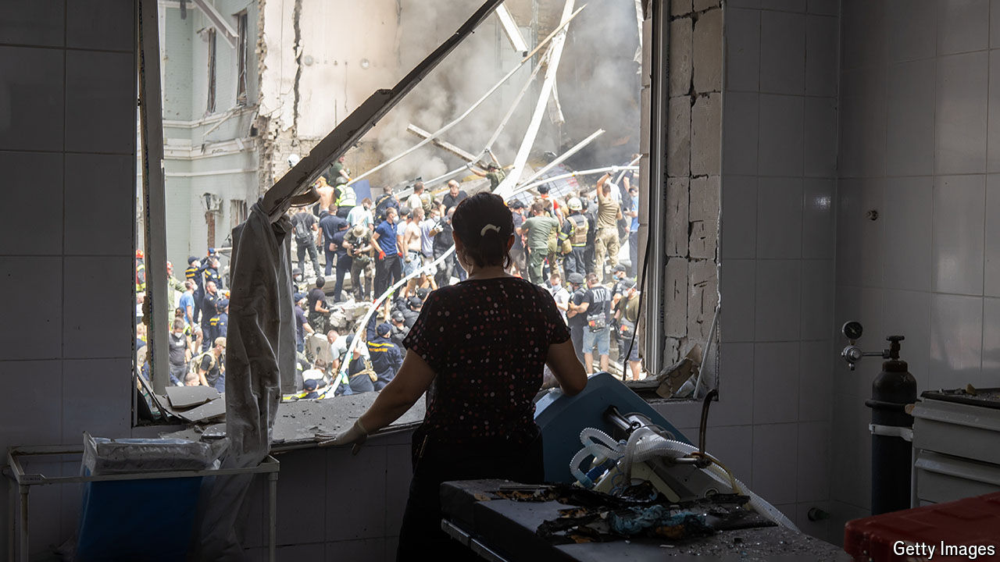

###### The latest outrage

# A Russian missile hits a children’s hospital in central Kyiv 

##### The Kremlin tries to deny responsibility 

 

> Jul 11th 2024 

Serhiy, a cardiac surgeon, stepped out from the Okmatdyt’s main building at about 1.30pm local time. He had spent the previous two hours stabilising his patient, a little girl who had been in the middle of open-heart surgery when the blast ripped through the children’s hospital. “There was chaos, glass flying everywhere,” he says. The surgeon and his patient were lucky. Across the yard the toxicology unit at the centre of the strike was in ruins. Amid the foliage in between lay a woman’s corpse, bloody legs sticking out of the carpet that had been wrapped around her lacerated body. 

The missiles that hammered down on Kyiv just before 11am on July 8th jolted the capital out of its sweaty summer daze. At least six missiles initially hit a military site 1.5km north of Ukraine’s leading specialised children’s hospital, piercing the sky in a terrifying staccato. But it was the missile that landed in Okmatdyt that was more shocking. Approximately 600 patients were in it at the time of the impact; the vast majority of the children were, thankfully, in bomb shelters. 


