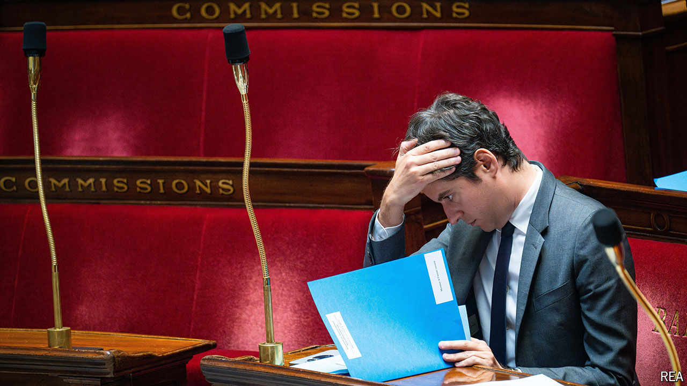

###### The French parliamentary election

# France is desperately searching for a government 

##### Party rivalry threatens deadlock before compromise 

 

> Jul 11th 2024 

After the relief, the confusion. France pulled back from the brink on July 7th when it rejected Marine Le Pen’s hard right at a final parliamentary vote. The electorate instead relegated her alliance to third place, and returned a hung parliament in which no bloc is close to holding a majority. But this has plunged France into new uncertainty. “Now what do we do?” asked the front page of , a daily paper, above a photo of a perplexed-looking President Emmanuel Macron. 

