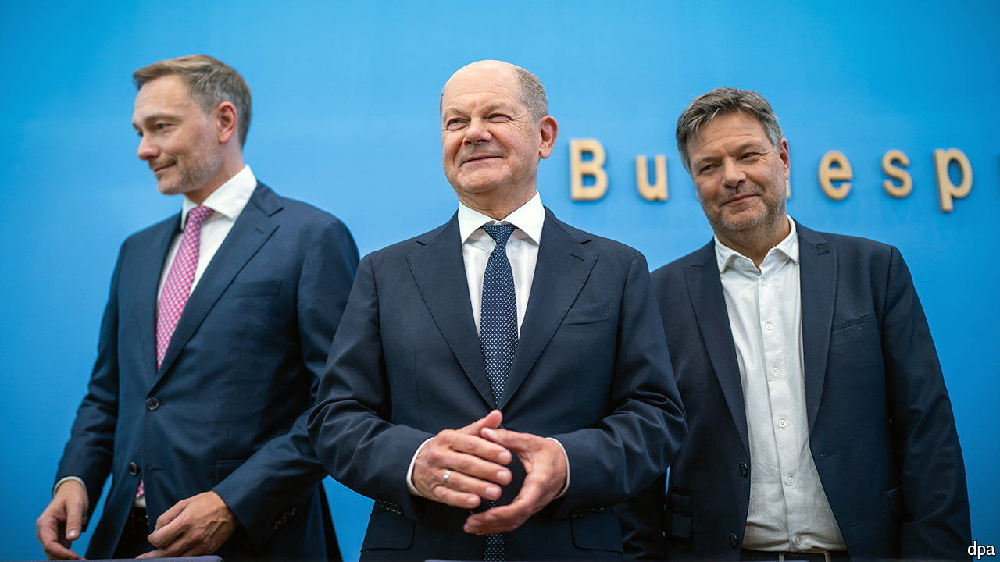

###### Houdininomics

# Germany’s debt brake and the art of fantasy budgeting 

##### The country is tiring of its self-imposed fiscal straitjacket 

 

> Jul 11th 2024 

Like A SQUIRMING Harry Houdini, Germany’s government has once again wriggled its way out of a straitjacket it applied to itself. On July 5th, having blown through one self-imposed deadline to conclude a draft budget for 2025, the coalition’s negotiators pulled an all-nighter to avoid missing a second. The result, said a bleary-eyed Olaf Scholz, Germany’s chancellor, was a “work of art”. 

