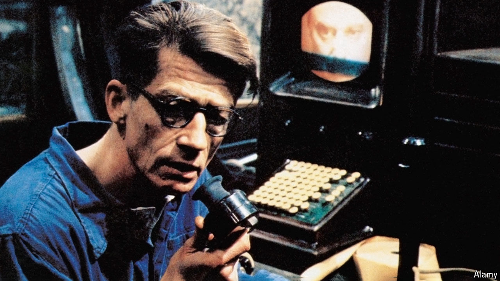

###### Ignorance is strength

# The Kremlin is rewriting Wikipedia 

##### A new version of history is taking shape 

 

> Jul 9th 2024 

WIKIPEDIA had faced trouble from  before, with Russian censors threatening it almost from the start of the Ukraine war in 2014. But it was only in late 2023, with the appearance of glitzy ads across Moscow, that a serious plan to replace it became clear. RuWiki, as the censors’ project is known, is mostly a straightforward copy of Wikipedia. But the most sensitive moments of history have been left out or rewritten. The Kremlin’s ideologues hope that millions of Russians will now embrace these new versions as the truth. 


The RuWiki project might be called , if the author were not himself occasionally censored. The entry on “Nineteen Eighty-Four”, for example, omits the regular site’s description of Winston Smith’s Ministry of Truth, where historical records are “corrected” (though Smith’s job gets a mention elsewhere). RuWiki’s rewriters hack their way through the sensitive zones of Putinist ideology: LGBT rights, oral sex, Soviet history and the war in Ukraine. 

