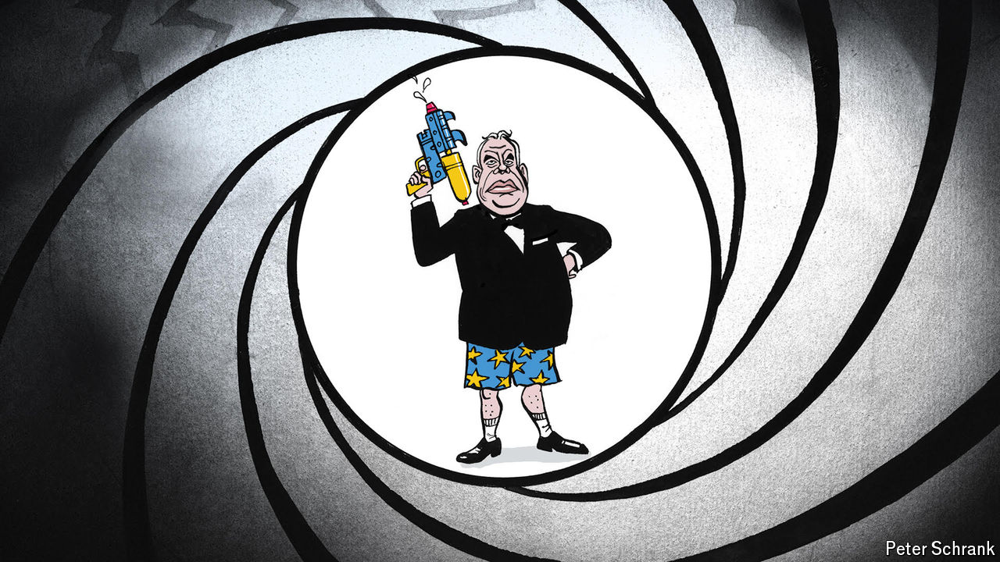

###### Charlemagne

# Viktor Orban solidifies his credentials as the EU’s pantomime villain 

##### The Hungarian prime minister’s “peace mission” to Russia has peeved Europeans 

 

> Jul 11th 2024 

Europeans, with their art-house sensibilities, can rarely match the dramatic heights coming out of Hollywood. At last the action blockbuster genre has crossed the Atlantic, in a series of short films released on social media in recent days. Their unlikely star is one Viktor Orban. Set to rousing music the producers of “Top Gun” might recognise, the clips feature the portly Hungarian prime minister as a latter-day Jason Bourne, striding decisively from motorcade to conference table, then back to his motorcade. Rapid-fire shots leave no doubt as to who is in charge. What the videos lack in terms of explosions and fight scenes they make up for with plenty of world leaders’ hands manfully shaken, documents assertively signed and platitudes emphatically uttered. The impossible mission having been completed, our Hungarian saviour stares into the distance, no doubt ready for a sequel. 

The pound-shop James Bond remakes are designed to flatter Mr Orban as he tries to big up his new gig as leader of the country that holds the rotating presidency of the Council of the European Union starting on July 1st. Alas, they are not the only consequence of the EU’s longest-serving national leader taking up the mantle until the end of the year. In what his official videographer has dubbed “Peace Mission 3.0”, Mr Orban has used his new position to engage in some freelance diplomacy in Kyiv, Moscow and Beijing before attending a summit of NATO leaders in Washington. The backdrops of the action-hero videos thus feature cameos by Xi Jinping and Vladimir Putin as Mr Orban dropped by China and Russia after visiting Volodymyr Zelensky in Kyiv.

