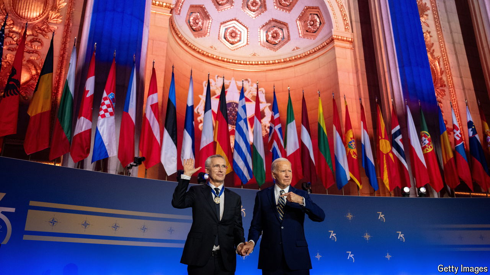

###### A bridge too far?

# When will Ukraine join NATO? 

##### Its road to membership could be blocked if Donald Trump becomes president 

 

> Jul 11th 2024 

Nato’s leaders gathered in Washington this week to overcome a big gap in their Ukraine strategy—between the principle that Ukraine is free to join the alliance with no veto by Russia and the reality that few are ready to let it in while it is at war with Russia. That proved impossible, so nato made do with lots of smaller commitments of weapons, money and training, and many warm words for Ukraine. 

A twisted metaphor stood out: the allies had built “a bridge” to nato membership. This was a “strong, robust, well-lit” thing, declared Antony Blinken, the American secretary of state, adding that it was “short”, too. In their communiqué, moreover, the allies declared that Ukraine’s progress towards nato was “irreversible”. 

