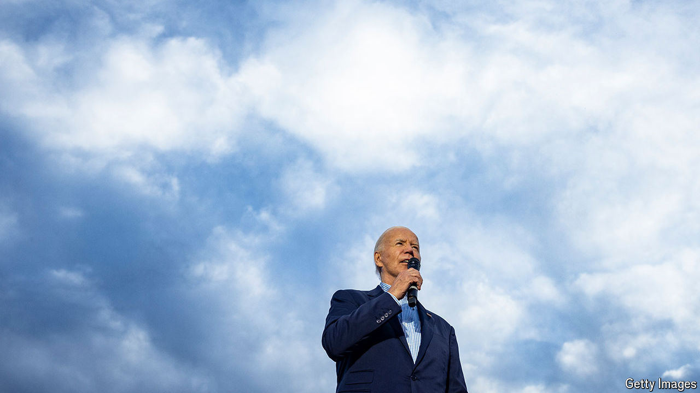
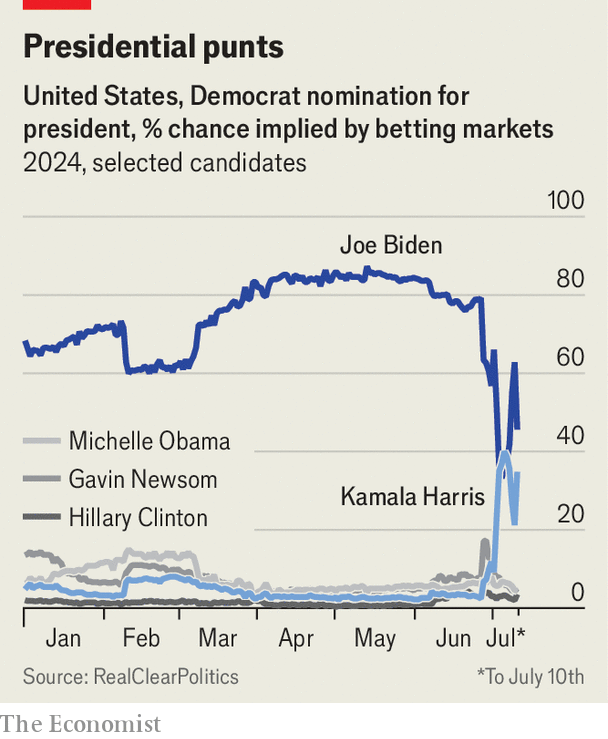

###### On the money

# Betting markets are useful when politics is chaotic 

##### Why, then, are they largely outlawed in America? 

 

> Jul 11th 2024 

In the early 20th century, for brief periods, the most frenetic American trading pits were not the raucous markets in which stocks were traded, nor the venues where bonds were exchanged. The real action was in the market for betting on the next president. “Crowds formed in the financial district...and brokers would call out bid and ask odds as if trading securities,” write Paul Rhode and Koleman Strumpf, two economists. Markets were deep, liquid and smart: in 15 presidential elections from 1884 to 1940, the favourite won 11 times and three races were essentially tied (in odds and result). Only once did markets miss the mark.

 


