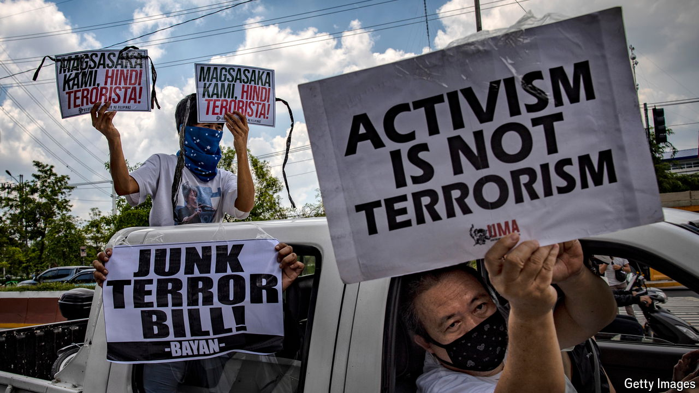

###### Good cop, bad cop

# How strongmen abuse tools for fighting financial crime 

##### They can get Western governments and banks to crack down on exiled dissidents 

 

> Jul 9th 2024 

In May 27 members of the Community Empowerment Resource Network (CERNET), a  charity, were charged with bankrolling communist rebels. Straight away the case looked strange. A social-media post by police claimed they had jailed Estrella Flores-Catarata, one of CERNET’s associates, who received an award from the UN for her work with indigenous people last year. She has no criminal record and was set free after paying bail. Other charities that support small-scale farmers and help people after natural disasters have also had their top brass charged and accounts frozen for allegedly breaching the Philippines’s Anti-Terrorism Act, a draconian law passed in 2020. 

