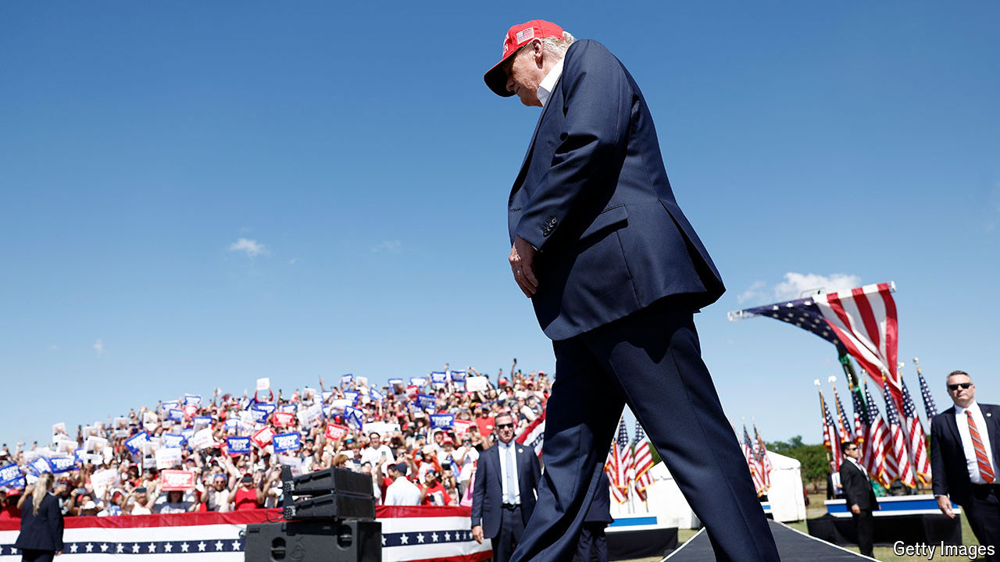

###### Halting his charge

# Trumponomics would not be as bad as most expect 

##### Opposition would come from all angles 

 

> Jul 11th 2024 

In markets it is known as the “Trump trade”, a bet that Donald Trump’s return to the White House would herald more inflation and higher interest rates. Many of Mr Trump’s core policies push in this direction: tariffs would add to import costs, deportations of immigrants could push up wages and deficit-financed tax cuts would juice the economy. Amid mounting inflation, the Federal Reserve would have little choice but to opt for higher rates.

In the wake of Joe Biden’s calamitous debate on June 27th, a preview of the trade played out. As investors grappled with the likelihood that Mr Trump would romp to the presidency, they sold off Treasuries, which led to a brief surge in yields. The big fear is that much worse would come to pass. If Mr Trump fought the Fed on rates, he might sow doubts about the central bank’s independence, undermining confidence in America’s markets and the dollar. That is the economic nightmare scenario for a second Trump administration.

But as with any nightmare, the bogeyman of Trumponomics may be more terrible than its reality. Mr Trump and his advisers have many rotten ideas. They also have some decent ones. And their ability to implement damaging policies will be constrained, with Congress, America’s institutions and markets all serving as checks.

