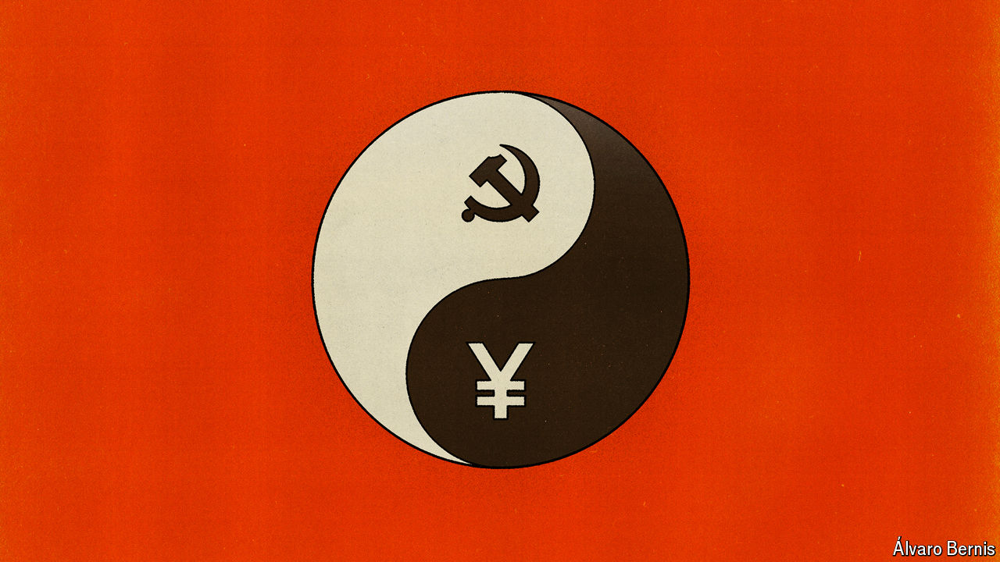

###### Free exchange

# Xi Jinping really is unshakeably committed to the private sector 

##### He balances that with being unshakeably committed to state-owned enterprises, too 

 

> Jul 11th 2024 

China’s paramount leader, Xi Jinping, contains multitudes. His economic philosophy touts both self-reliance and openness. His vision of policymaking embraces top-down design, but also bottom-up experimentation. During the covid-19 pandemic, he urged local officials to eliminate infections (which often required lockdowns) and promote growth (which required mobility). His recent call to cultivate “new productive forces” entails championing cutting-edge technologies, but without neglecting traditional industries. Communists are taught to believe in the power of contradictory forces, as Trivium, a consultancy, once put it. So Mr Xi “will expect his comrades to cope”.

