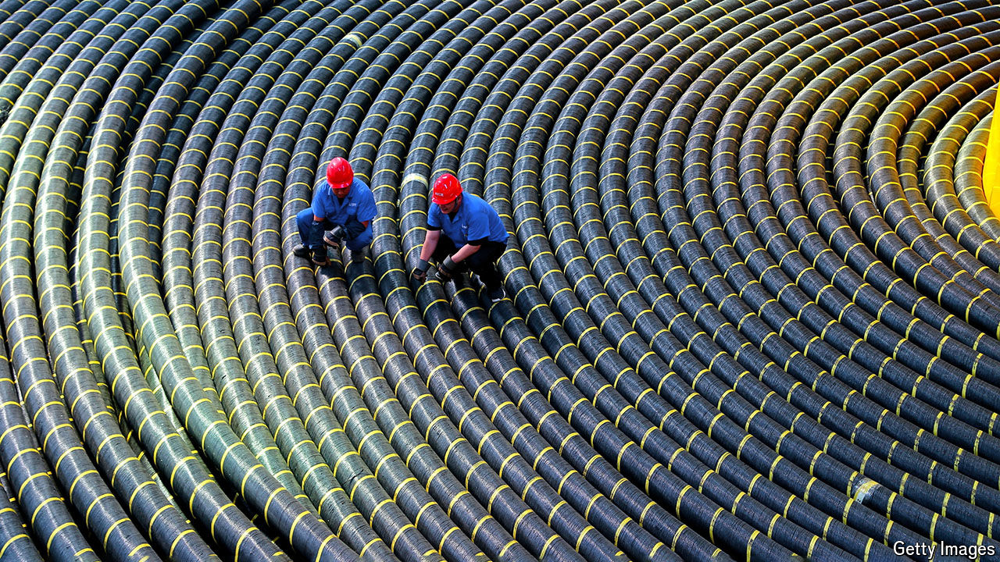

###### Cable ties

# How China and Russia could hobble the internet 

##### The undersea cables that connect the world are becoming military targets 

 

> Jul 11th 2024 

NOT LONG ago a part of the British government asked RAND Europe, a think-tank in Cambridge, England, to conduct some research on undersea critical infrastructure. The think-tank studied publicly available maps of internet and electricity cables. It interviewed experts. It held focus groups. Halfway through the process Ruth Harris, the leader of the project, realised that she had inadvertently unearthed many sensitive details that could be exploited by Russia or other adversaries. When she approached the unnamed government department, they were shocked. The reaction, she recalls, was: “Oh my god. This is secret.” When they learned that Ms Harris’s team was drawn from all over Europe, they demanded that it be overhauled, she says: “This needs to be UK eyes only.” 

