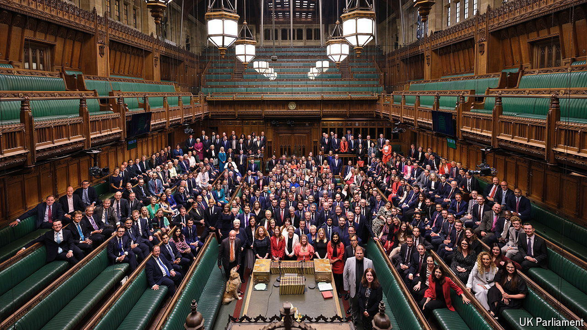

###### Lord, make us proportional—but not yet

# Britain’s skewed election reinforces the case for voting reform. After 2029 

##### The new government has more important things to deal with first 

 

> Jul 11th 2024 

Among the questions prompted by  on July 4th is whether Britain’s electoral system needs overhauling. The party won 63% of the seats on only a third of the vote, prompting complaints from some smaller parties, and a few smarting Conservatives, that the result was unfair. The case for reforming the country’s first-past-the-post (FPTP) system, in which the candidate who wins the most votes in a constituency takes that seat, is becoming ever stronger. But it should not be a priority.

Measured by the difference between share of the votes and share of the seats in Parliament, this election was the , and second in Western democracies only to a French parliamentary election in 1993. Because its voters were efficiently distributed around the country, Labour needed fewer than 24,000 votes for each of its seats. , in contrast, needed well over 800,000. Under the Scottish system of proportional representation (PR), Labour would have won 236 seats, not 411; Reform UK would have had 94 MPs instead of five.

