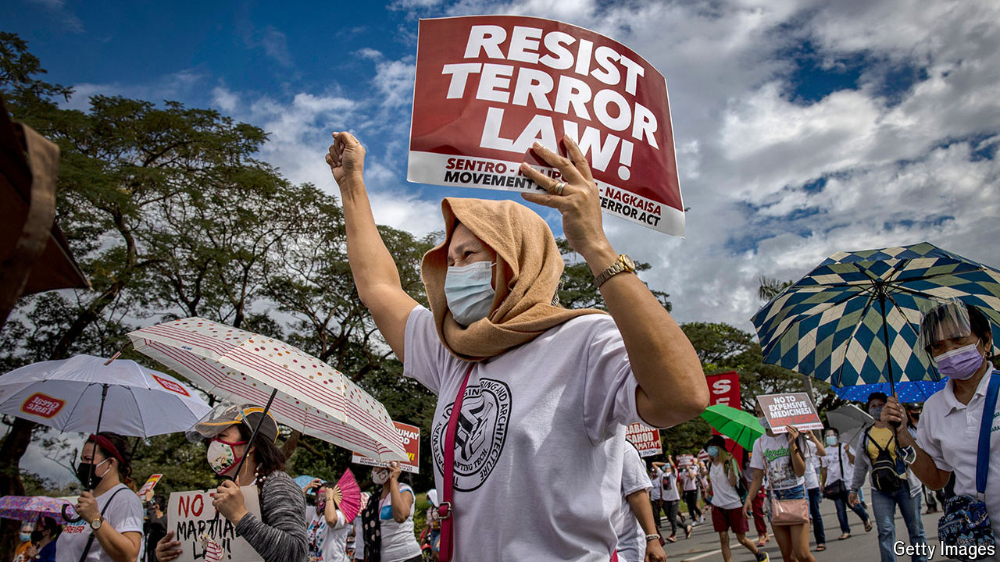

###### Credit-crushed

# How to prevent strongmen from hijacking the fight against dodgy money 

##### Egypt, India and Turkey are regular abusers 

 

> Jul 11th 2024 

CATCHING criminals across borders is hard. Court decisions made in one place may not be enforceable in another. Police powers are usually local, and information-sharing and extradition treaties are rare. To remedy this the world’s major powers have created  with mandates that cover much of the globe. The  investigates suspects for genocide, war crimes and other grave offences. Interpol issues “red notices”, which are akin to international arrest warrants. Perhaps the most obscure is the Financial Action Task Force (FATF), which also has the hardest job: stopping globe-trotting villains from moving money around the world. 

