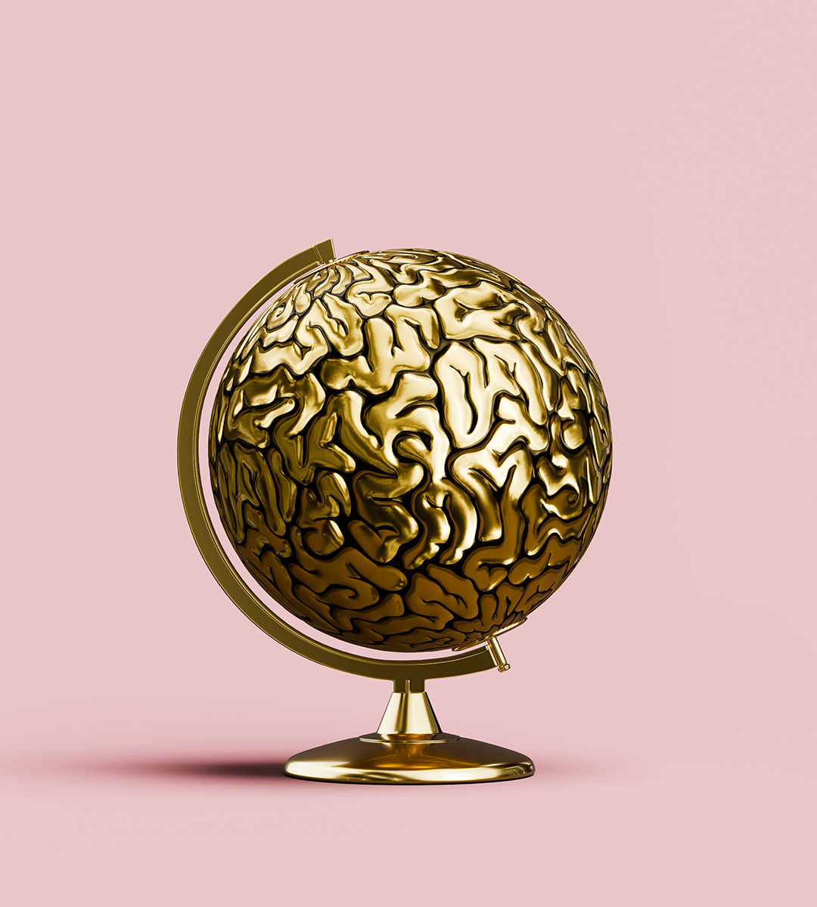

###### Nutrition and cognition

# How to raise the world’s IQ 

##### Simple ways to make the next generation more intelligent 

 

> Jul 11th 2024 

People today are much cleverer than they were in previous generations. A study of 72 countries found that average IQs rose by 2.2 points a decade between 1948 and 2020. This stunning change is known as the “Flynn effect” after James Flynn, the scientist who first noticed it. Flynn was initially baffled by his discovery. It took millions of years for the brain to evolve. How could it improve so rapidly over just a few decades?

