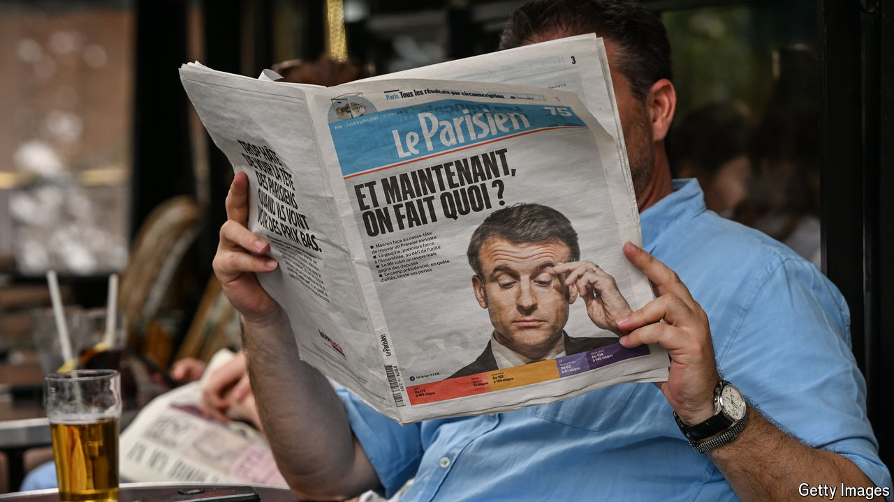

###### France’s shotgun election

# The French far right may not have peaked 

##### After winning 32% of the vote in parliamentary elections it will eye the presidency 

 

> Jul 10th 2024 

FRANCE’S FOURTH REPUBLIC lasted from 1946 to 1958. In those 12 years it had 26 governments, two of which were in power for only two days. The Fifth Republic created by Charles de Gaulle in 1958 was meant to provide greater stability, thanks to a new electoral system and a strengthening of the powers of the president. It has worked pretty well. Until now.

