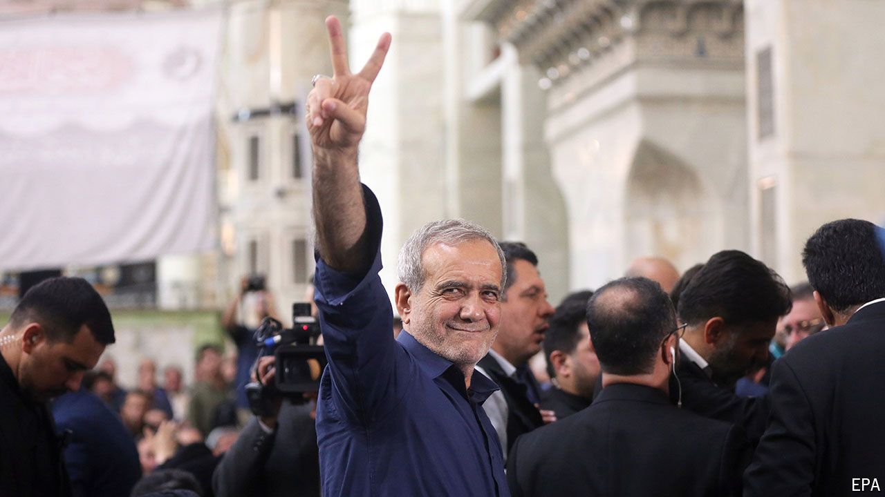

###### Elections in Iran

# Iran’s new hope: a cardiologist president 

##### He is said to detest the capital, Tehran. Can he master its politics? 

 

> Jul 11th 2024 

The election of Masoud Pezeshkian, a reform-minded cardiologist, as president of Iran on July 5th prompted jubilation. In the hours after the vote, men and women danced in the streets as if the country’s strict dress code were no more. Some speculated that they would now escape the grip of their ayatollahs and of American sanctions. Hossein Derakhshan, a former political prisoner now close to Mr Pezeshkian, chirped that this was “the age of freedom from the cage”. 

Mr Pezeshkian’s election certainly heralds change. After four decades of five clerics and one (a staunch supporter of the regime), ordinary Iranians at last have a president who looks and speaks like them. He articulates the concerns of the increasingly impoverished middle class. He comes from the marginalised north-west. He ran the university hospital in Tabriz, its main city, which he represented in parliament for 16 years. He is said to detest the capital, Tehran. The furniture in the flat he keeps there is tacky and unloved.

