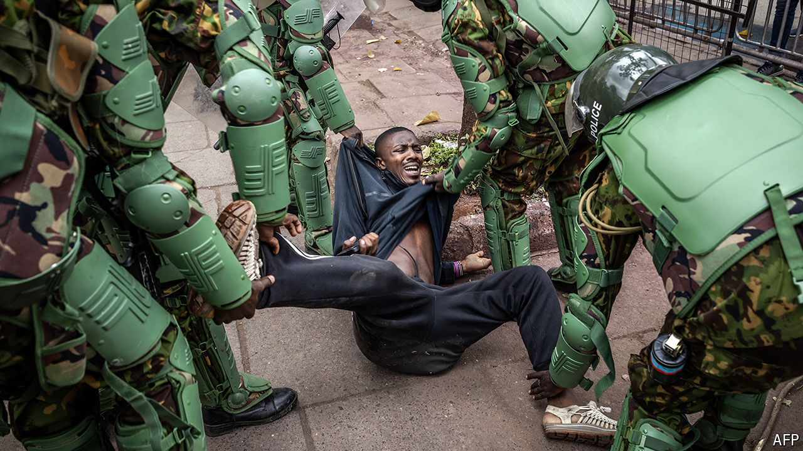

###### Zacchaeus climbs down

# Kenya’s deadly Gen-Z protests could change the country 

##### Almost 40 people have died in violence 

 

> Jul 9th 2024 

For weeks Kenya has been . Confronted with demonstrators denouncing the tax policies of , Kenya’s president, the security forces responded ruthlessly. They have killed at least 39 people, most of them in Nairobi on June 25th, when protesters briefly overran Parliament and set a portion of it ablaze. Looting has also erupted in several towns and cities, though it is unclear whether this was by state-backed provocateurs, as the protesters allege, or by opportunist criminals, as Mr Ruto claims.

Yet far from provoking fear among Kenya’s better-off, the unrest has inspired wild optimism. Unlike most protests in recent decades, these are led by young, eloquent, educated Kenyans who are unsullied by political or tribal allegiance. Their cause—an end to corruption, injustice and inequality—seems noble rather than tawdry. Instead of championing a self-serving political leader or faction, they have denounced the entire political class. These protests have consequently united rather than polarised people. Perhaps the only parallel that can be drawn is with the protests led by the present lot’s parents, who also braved police bullets in 1990 to demand, successfully, an end to dictatorship and the restoration of multiparty elections.

The reverberations of the “Gen-Z protests”, as they are known in , could be as profound. Mr Ruto has been weakened and humiliated. Could the chastening of the political class lead to a cleansing of corruption and fairer politics? Stung by the extent of the unrest, Mr Ruto has capitulated on tax. Much will depend on whether Kenya’s people and its rulers can overcome the challenges and seize the opportunities created by past weeks’ events.

