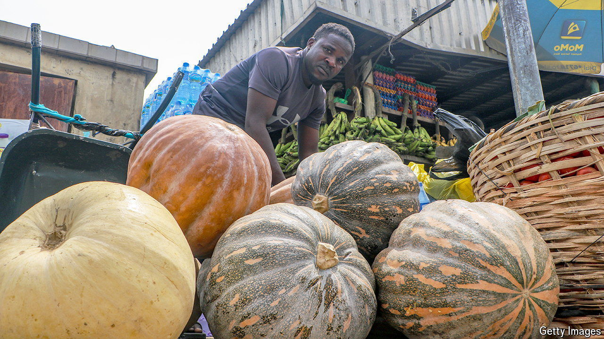

###### Half a bowl of stew

# Soaring food-price inflation is hurting Nigeria’s poor 

##### Conflict, a weakening currency and government blunders are all to blame 

 

> Jul 11th 2024 

In a video on social media, Amarachi makes a stew that replaces pricey tomatoes with more affordable watermelon chunks. “Today we say bye-bye to tomatoes,” she says. As Nigerians adjust to soaring food prices, the video has gone viral.

 


Tomato prices that fluctuate with the seasons are normal in Nigeria, but the record annual pace of food inflation, which hit 41% in May, is not. Most pinched are the poor. Staples such as beans and maize cost 400% more than they did a year ago, while a 100kg bag of sorghum has more than tripled in price. Since wages have barely moved, the result is a deepening food crisis. Whereas hunger was once concentrated in conflict-ridden areas in northern Nigeria, now it affects poorer households nationwide (see map). Of the 44m people in west Africa and the Sahel who do not get enough to eat, more than half are Nigerian. 

