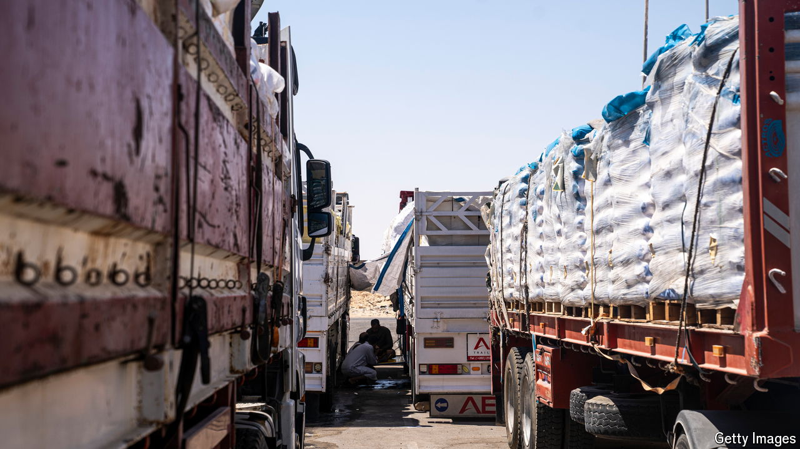

###### The flow of aid

# Why food is piling up on the edge of Gaza 

##### Thousands of tonnes of food and medicine are still waiting to get in 

 

> Jul 11th 2024 

Judging by the amount of aid that has arrived at the Egyptian side of the border with Gaza, the embattled Palestinians should be well catered for. Canvas warehouses rise out of the desert, piled high with blankets and tents. Depots are packed with medicines and sanitary kits. Lorries loaded with food line the roadsides in their thousands. And a floating hospital with 100 beds, courtesy of the United Arab Emirates, is docked at a nearby Egyptian port.

