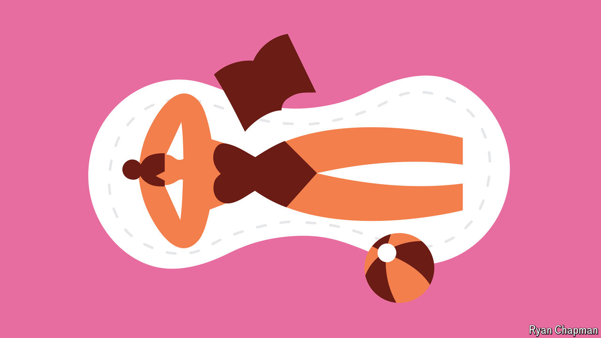

###### Periods

# A scientific discovery could lead to leak-free period products 

##### Polymers from algae can turn menstrual blood into a gel 

 

> Jul 11th 2024 


BLEEDING THROUGH a tampon or pad never makes for a good time. The risk of leaks is annoying and stressful for all women who bleed, and especially for the 20% to 30% whose menstrual flow is so heavy that they sometimes must change their tampons or pads every hour. Some dread leaving their homes for fear of getting caught out. 

