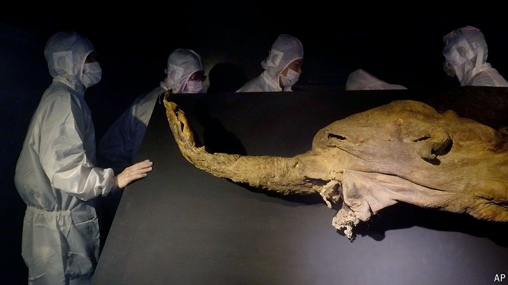

###### Windows on the past

# Freeze-dried chromosomes can survive for thousands of years 

##### They contain unprecedented detail about their long-dead parent organisms 

 

> Jul 11th 2024 


For palaeontologists, DNA is infuriatingly fragile. Its long chains begin to break apart shortly after death, destroying valuable information about the deceased parent organism. Unlike bones, footprints and even faecal matter, which can comfortably survive—in fossilised form—for millions of years, DNA rarely lasts much more than a hundred. In recent decades scientists have discovered that some exceptionally well-preserved bodies do still have readable fragments of genetic code hundreds of thousands of years after death. But these have been tiny scraps. They lack much of the valuable information that an intact genome provides.

A major advance may be at hand. A new paper in , a scientific journal, describes the discovery of fossil chromosomes—coiled-up strands of DNA millions of base pairs long—inside the cells of mammoths that died tens of thousands of years ago. The research “really opens a door for a new kind of exploration of ancient life”, says Erez Aiden of the Baylor College of Medicine (BCM) in Houston, Texas, who is one of the paper’s lead authors.

