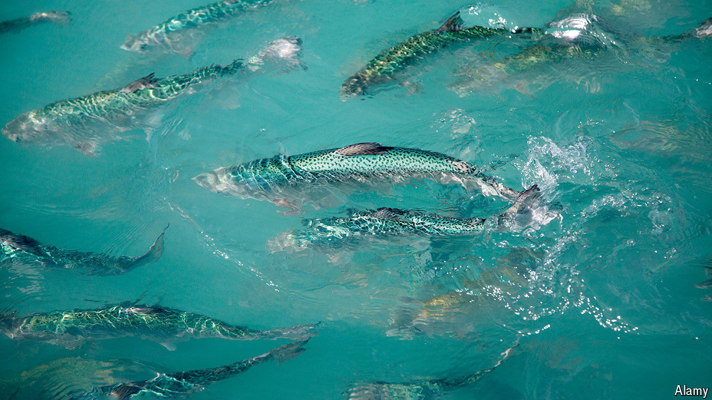

###### Aquaculture

# Vaccines could keep salmon safe from sea lice 

##### A successful jab would be a boon to fish farmers 

 

> Jul 10th 2024 

ERIK SLINDE has spent 40 years developing vaccines. Not for humans; for salmon. “Back in the 1980s, it was looked upon as a joke,” says Dr Slinde, the former director of aquacultural research at the Institute of Marine Research in Norway. 

Nobody is laughing now. Sea lice—rice-grain-sized crustaceans that have evolved to parasitise salmon fish and live inside them, munching away at their skin, protective mucus and blood—have been ravaging salmon aquaculture worldwide. The burden is heavy—infestations cost the  alone more than £20m ($25.6m) each year—and, for now, there are no good, long-term solutions. The development of a successful louse-preventing vaccine could change that. Some teams think they might be close. 

Sea lice come in many varieties, but all share a common . By eating salmon alive they weaken them and compromise their immune systems, leaving entire farm populations susceptible to new infections acquired through their open wounds. As they enjoy warm waters dense with fish, aquaculture and climate change have boosted their numbers. 

