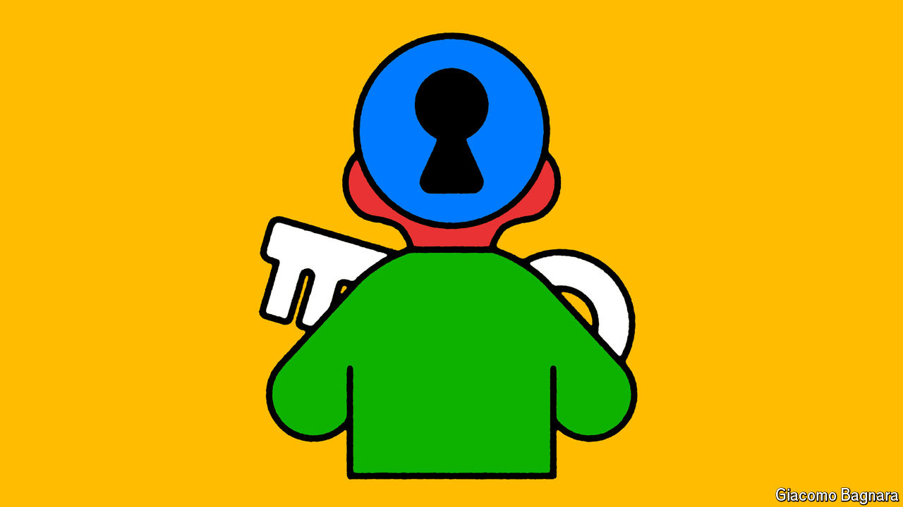

###### Soft skills

# Efforts to teach character bring promise and perils 

##### ‘Social and emotional learning’ bundles good sense with some quackery 

 

> Jul 7th 2024 

Aristotle TAUGHT his students the importance of managing their emotions. John Dewey, an early 20th-century reformer, sparked the idea that teachers must educate the “whole child”. For decades wealthy parents in Britain (and a few other places) sent kids to boarding schools in the hope that they would pick up traits such as independence and resilience. It is not controversial to argue that a young child’s first years in education are as much about learning social skills and self-control as about anything else.

Many educators today take enthusiastically to this thinking, under the auspices of “social and emotional learning” (SEL), a term as fuzzy as it is ubiquitous. Proponents of SEL say that teachers could be doing heaps more to instil in youngsters useful attributes such as optimism, empathy and emotional stability. The pandemic supercharged interest in this approach, as educators searched for ways to shore up young teens’ lagging social skills or give them techniques for beating the blues. Yet critics see a shiny distraction from the hard graft of academic learning. They worry that all sorts of spurious ideas are riding in on its coat-tails.

