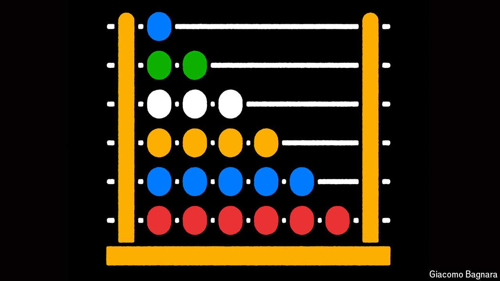
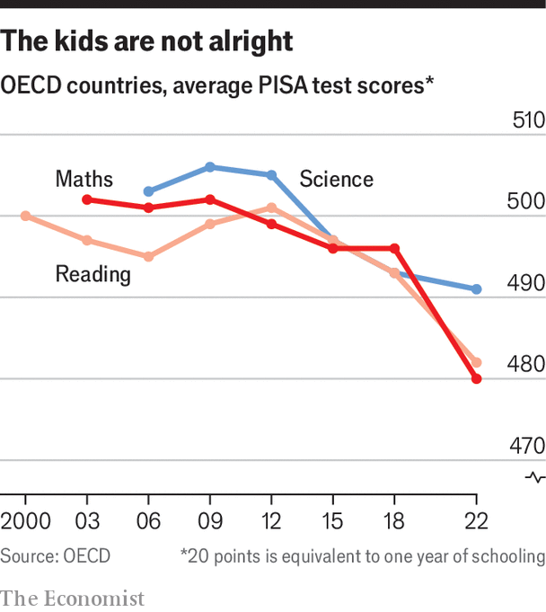

###### Schooling’s stagnation

# Schools in rich countries are making poor progress 

##### They need to get back to basics, argues Mark Johnson 

 

> Jul 7th 2024 

Even before the covid-19 pandemic ejected millions of children from their classrooms, schools across America were stuck in a rut. For 50 years the country has tracked pupils’ performance in maths and reading through its National Assessment of Educational Progress, a series of reference tests that are sometimes referred to as the “Nation’s Report Card”. For most of those five decades, scores kept improving. But they reached a plateau in the early 2010s. By 2020 test scores had started edging down.

 


Test scores in many other rich countries (the focus of this special report) also show gloomy trends. For two decades analysts at the OECD, a club of mostly rich countries, have been asking 15-year-olds in dozens of places to sit comparable exams for what is known as the Programme for International Student Assessment (PISA). In 2018 these tests found that a typical 15-year-old in the OECD countries was no more adept at maths, reading or science than had been the case in the early and mid-2000s (see chart). In science and reading, scores had generally risen until 2009 and 2012 respectively, after which they fell back down. In maths they largely plateaued. This was the case even though spending per pupil had been going up.

