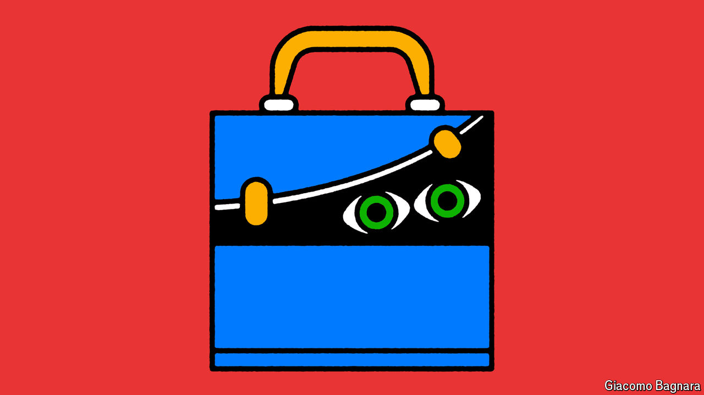

###### Teachers

# The rich world’s teachers are increasingly morose 

##### Hanging on to the best of them is getting harder 

 

> Jul 7th 2024 

In a secondary school on the outskirts of Tallinn, the capital of Estonia, a pupil scrawls the solutions to mathematical equations on a whiteboard. His teacher, a young woman, stands at the back helping to guide the student and encouraging his peers to comment. In a chemistry lesson down the corridor, two students race to scribble out formulae for compounds while their classmates offer helpful critiques. 

