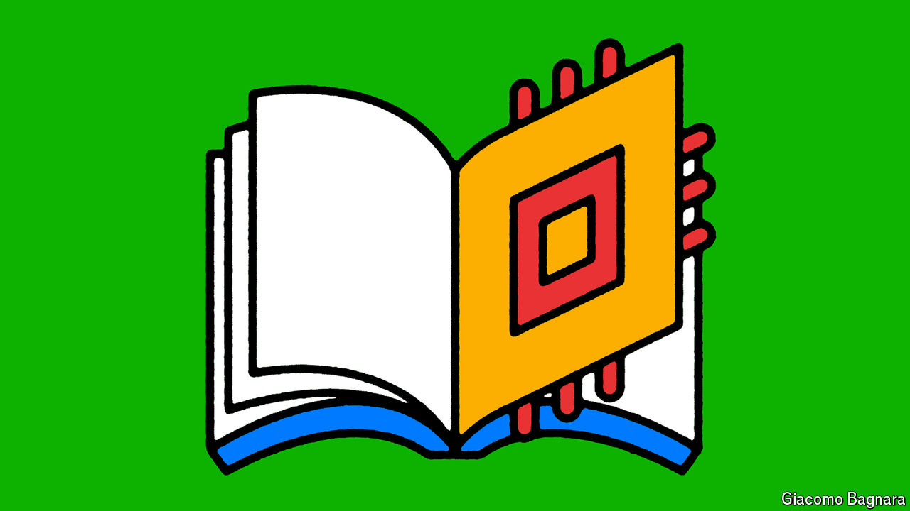

###### Technology

# Will artificial intelligence transform school? 

##### The boldest visions for AI in classrooms misunderstand much about education 

 

> Jul 7th 2024 

“Books will soon be obsolete in schools,” opined Thomas Edison in 1913. He believed the motion picture would replace texts and teachers as means of instruction, and that it would happen within a decade. A century later, Mr Edison is unwilling to admit error, no matter how hard your correspondent probes. He insists his prediction was “not entirely incorrect”, and that he got it “both right and wrong”. The best he will offer is that it was “perhaps a bit premature”.

This slippery interviewee is not, needless to say, the long-dead Wizard of Menlo Park. It is a chatbot generated by Khanmigo—a set of AI tools designed for students and teachers that was released in America last year. Users who tire of teasing Mr Edison can speak instead to other giants of history like Albert Einstein, Winston Churchill or William Shakespeare, or with famous characters from literature. Kids may ask Captain Ahab about his whale, Victor Frankenstein about his monster, and Winnie where he got the name Pooh.

