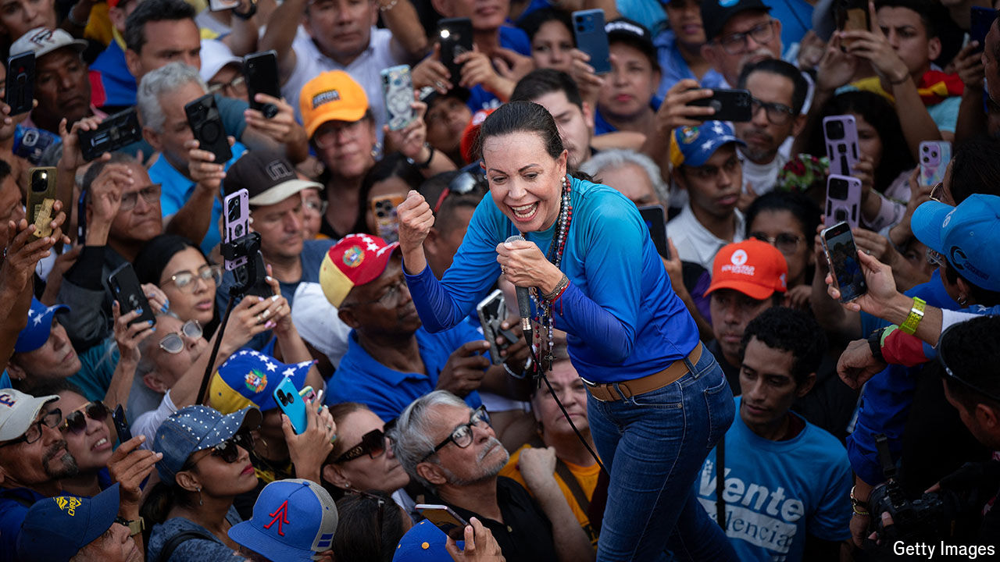

###### Voting against Maduro

# A new danger for Venezuela’s autocrat 

##### The regime’s dilemma is rig or lose the election on July 28th 

 

> Jul 11th 2024 

A  CACOPHANY of revving motorcycle engines, vuvuzela trumpets, salsa music and chants of “this government is going to fall” filled the streets of Caracas on July 4th at an opposition rally in the capital to mark the start of 24 days of official campaigning before the presidential election. Most in the crowd of several thousand were there to see María Corina Machado, Venezuela’s popular opposition leader, who has become a symbol of resistance to the authoritarian regime of President Nicolás Maduro. Perched atop a lorry and dressed in jeans, she blew kisses of appreciation to her giddy supporters. “We are counting the days until we will be free,” cried one woman, as the convoy passed.

At the last presidential election in 2018 Mr Maduro secured re-election by disqualifying the main opposition candidates and parties and by discouraging voting (turnout was 46%). This election looks trickier for the regime: stealing it against a united and seemingly mobilised opposition, and with palpable disillusion among many government supporters, might not be easy. 

