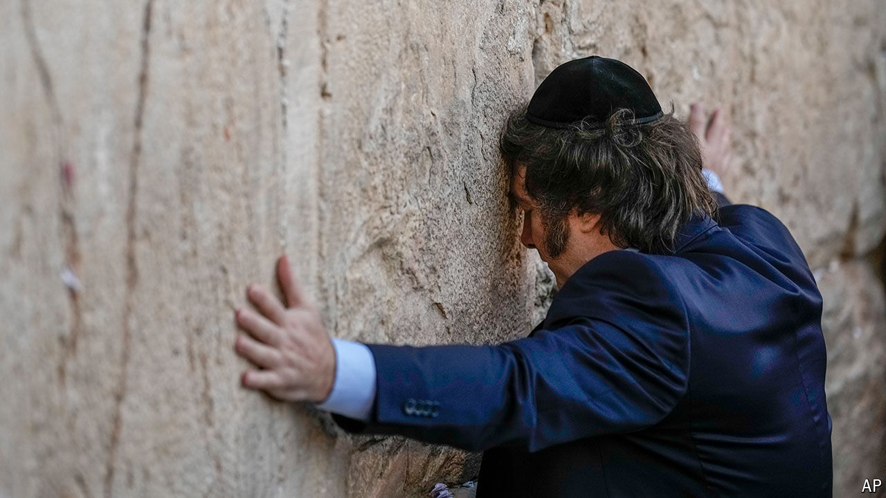

###### Of Milei and Moses

# In Catholic Argentina, Javier Milei embraces Judaism 

##### That is not universally welcomed by Argentine Jews 

 

> Jul 11th 2024 

Arms spread with a black kippah on his head, Javier Milei, the Argentine president, presses his forehead against the Western Wall in Jerusalem (see picture) and begins to weep. Overwhelmed, he hugs his Orthodox rabbi, Shimon Axel Wahnish. Mr Milei’s visit in February to one of Judaism’s holiest sites was the most public moment yet in his embrace of the religion. At a rally last year in a Jewish part of Buenos Aires, the capital, the word and an illustration of a man with the traditional Jewish ram’s horn were projected onto screens as the sound of the horn blared. In April Mr Milei was made an “ambassador of light” in a ceremony conducted at The Shul, a Hasidic synagogue in Surfside, Florida. 

Mr Milei, who calls himself an “anarcho-capitalist”, has not officially converted to Judaism, but says he goes to synagogue and studies the Torah. His embrace of Orthodox Judaism is unusual for a global leader, and even more so in Argentina, where until 1994 the constitution required a president to be Catholic. The country’s Jewish community, 171,000-strong, is South America’s biggest and the world’s fifth largest. But it forms a small minority of Argentina’s 46m people.

Mr Milei’s pious bent prompts mixed feelings among Argentine Jews. His Judaism seems to play a role in his messianic self-image. “My main reference…is Moses,” he told , an Argentine newspaper. At his rallies some supporters, copying the president’s sister, Karina, who is his closest aide, wear caps emblazoned with the phrase “The forces of heaven”. That is a quote from the Third Book of Maccabees, an ancient Greek text which though about Jews is not canonical in Judaism: “In battle, victory does not depend on the number of soldiers, but on the forces of heaven.” 

