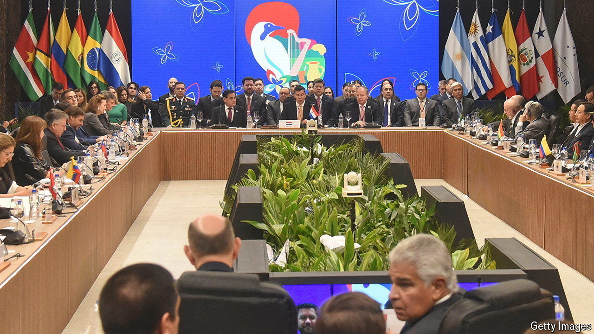

###### Unhappy union

# The irrelevance of Mercosur 

##### Once the herald of a liberal future, the trade bloc’s members are increasingly at odds 

 

> Jul 11th 2024 

It was an especially pointed snub. Skipping the twice-yearly get-together of the presidents of Mercosur, Javier Milei, Argentina’s president since December, chose instead to speak to the hard right at a Conservative Political Action Conference in Brazil. “If Mercosur is so important, all presidents should be here,” huffed Luis Lacalle Pou, Uruguay’s centrist leader, at the summit in Asunción, Paraguay’s capital.

