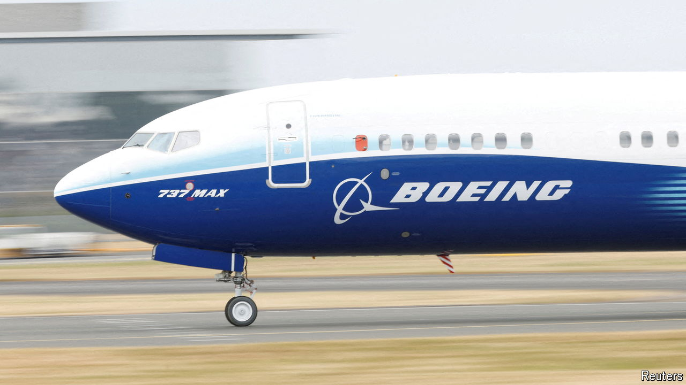

###### The world this week

# Business 

#####  

 

> Jul 11th 2024 

In a court filing, America’s Justice Department revealed that  would plead guilty to misleading air-safety regulators about its 737 MAX aircraft ahead of two fatal crashes in 2018 and 2019. The agreement rips up a previous settlement from 2021 in which Boeing admitted that two employees had misled regulators. The government believes Boeing has failed to comply with that settlement. There have been a number of safety incidents this year, including a door plug that blew off a 737 MAX upon take-off. The families of the crash victims are not happy. By pleading guilty, Boeing avoids the glaring publicity of a trial. 

 has reportedly given up its board seat at OpenAI amid scrutiny from competition regulators about the pair’s partnership. Microsoft holds a minority economic interest in the developer of ChatGPT.  has also decided not to join OpenAI’s board as an observer, according to reports. Apple recently struck a deal to incorporate ChatGPT into its new operating system. 

In what both companies described as the largest deal of its kind, announced an agreement to sell 500,000 tonnes of carbon-dioxide removal credits to  over six years. The arrangement allows Microsoft to offset its emissions by paying Occidental to take carbon from the atmosphere and store it underground. The tech giant’s emissions have soared in recent years, mostly because of the huge amounts of power needed for artificial intelligence and data centres. 

