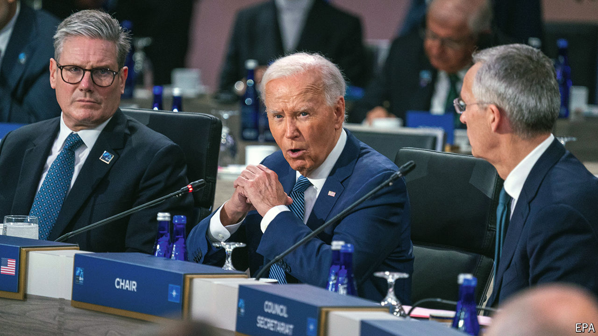

###### The world this week

# Politics 

#####  

 

> Jul 11th 2024 

 held a summit in Washington, marking its 75th anniversary. The main topic of discussion was support for . The country is unlikely to be admitted as a NATO member soon. But “Make no mistake,” Joe Biden said, “Ukraine can and will stop Putin.” America, Germany, Italy, the Netherlands and Romania announced that they would provide five extra air-defence systems, including the Patriot system, to Ukraine. The summit started the day after Russia carried out its biggest wave of attacks in months, and struck a in Kyiv. At least 41 people were killed across Ukraine and 170 injured. 

Mr Biden used the summit to try to put to rest questions about his mental acuity and ability to lead. Calls grew among some  for the president to withdraw from the election. But other senior Democrats, including Chuck Schumer, in public at least, forcefully supported Mr Biden during party meetings in Congress. Mr Biden earlier insisted that “I am running and I am going to win again.” 

The NATO summit was Sir Keir Starmer’s first foray on the international stage as  new prime minister. Sir Keir’s Labour Party won 411 seats in the general election, giving it a working majority of 181. The new government has made a busy start, scrapping a controversial scheme to deport asylum-seekers to Rwanda, unveiling measures to liberalise the country’s  and taking the first steps towards setting up a new national wealth fund.

