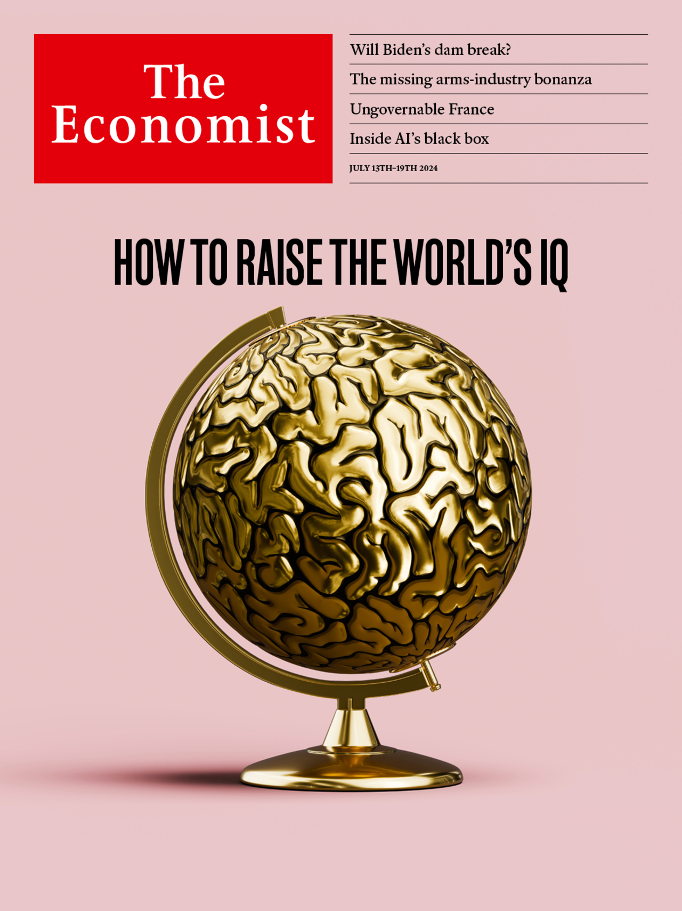

###### The Economist

# This week’s cover 

##### How we saw the world 

> Jul 11th 2024 

This week we look at two ways in which young minds are being squandered. Our special report and leader examine why educational attainment in the rich world has levelled off, and what can be done about it. In a separate briefing we examine an even graver problem. In poor and middle-income countries many children are still too ill-fed to reach their cognitive potential.

 


 

 


