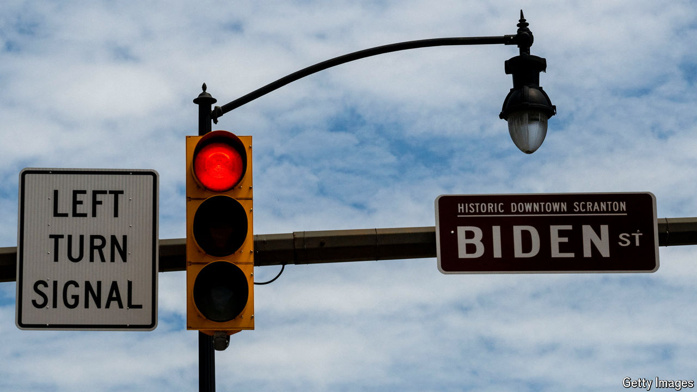

###### Marginal revolution

# Anguish about Joe Biden’s candidacy is rational, polls suggest 

##### Would Kamala Harris fare better? 

 

> Jul 9th 2024 

IF JOE BIDEN and Donald Trump have one thing in common, it is that they don’t trust the polls. During the Republican primaries, Mr Trump referred to polls that showed his opponent Nikki Haley too close for comfort as “just another scam”. Now Mr Biden has cast doubt on polls that show him trailing Mr Trump in swing states or plagued by historically low approval ratings. “I don’t believe that’s my approval rating,” he shot back at George Stephanopoulos in a  on ABC, which was meant to assuage Democrats’ anxieties after his  against Mr Trump. “That’s not what our polls show,” he added, referring to his campaign’s internal polling.

