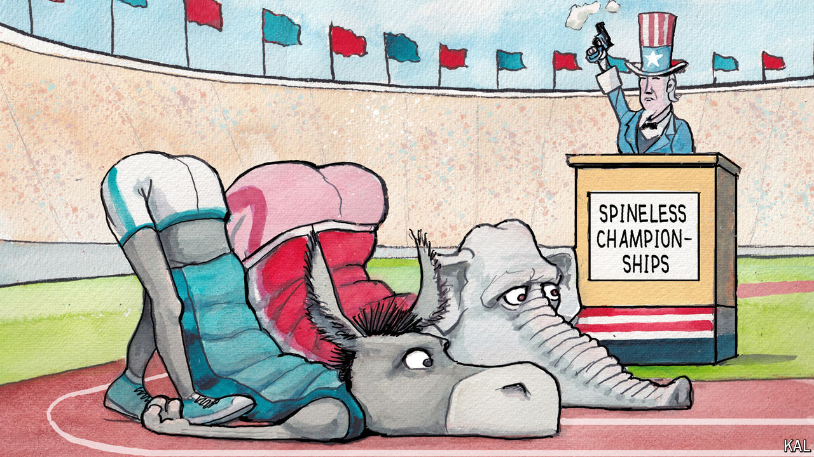

###### Lexington

# How do you solve a problem like Joe Biden? 

##### The uproar over his candidacy reveals dysfunction afflicting both major parties 

 

> Jul 11th 2024 

It is as though a giant trap has sprung: Democrats suddenly find themselves faced with the prospect of losing the White House and both houses of Congress just as the Supreme Court’s conservative majority has  and hobbled the administrative state. Democrats’ scorn for Republicans at choosing an unpopular nominee for president, a candidate compromised by criminality and extremism, has turned to panic as they realise they may have committed to a nominee  in the eyes of voters, by infirmity. How did the party get itself into this mess? How can it fix things?

The answers are it didn’t and it can’t—at least not in the short term. Indeed, these are trick questions, because they imply that a major party is capable of making independent decisions. Leaders of both parties long ago surrendered any decisive role in choosing nominees, which is why Donald Trump could conduct what his son-in-law, Jared Kushner, called “a full hostile takeover of the Republican Party”. Since President Joe Biden sabotaged his candidacy in a fateful debate, the Democrats have revealed a comparable vulnerability: they cannot co-ordinate their various power centres in Congress and state governments to provide a clear vote of confidence, or no-confidence, in their candidate. The signals are way way way more inefficient than most of us thought, and I thought they were pretty inefficient to start with,” says Daniel Schlozman, a political scientist and the author, with Sam Rosenfeld, of “The Hollow Parties”, a new book on the parties’ decline.


