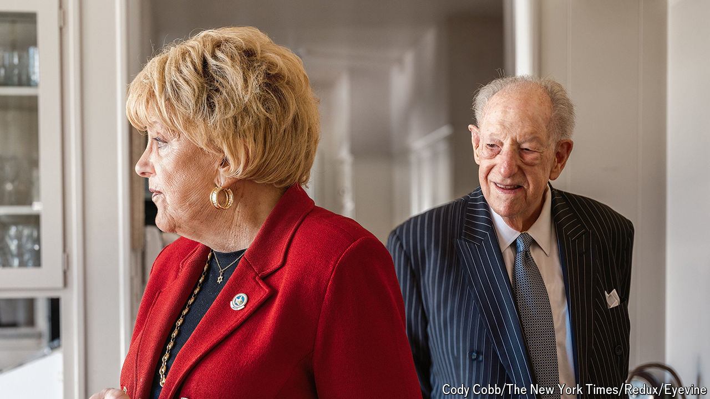

###### From mafia town to metropolis

# Las Vegas’s power couple says goodbye to power 

##### The Goodmans were mayors for 25 years. Their evolution mirrors that of Sin City 

 

> Jul 9th 2024 

CAROLYN GOODMAN had a big decision to make. Her husband, Oscar, a former defence attorney for reputed mobsters, was going to be term-limited after serving 12 years as mayor of Las Vegas. He wanted her to succeed him. It was 2011, and there were already more than a dozen candidates vying for the job. “I said, ‘All right, I’ll file. But under one condition,’” she recalls. She coveted the black and white $100 poker chips with Mr Goodman’s likeness that he used as a business card. “I want my own chip if I win,” she demanded, “and I want it to be $1,000.”

Thirteen years later, Mrs Goodman finds herself in a similar position to her husband. She will leave office this year after serving three terms as mayor (plus an extra year when the city juggled its electoral calendar). But no other Goodman is waiting in the wings. When a new mayor is elected in November, it will mark the end of a quarter-century of Goodman rule in Las Vegas. The couple’s time in office, and their lives, are worth considering. Now in their mid-80s, they are a bridge between —a sparsely populated playground for mobsters—and the modern desert metropolis. 

