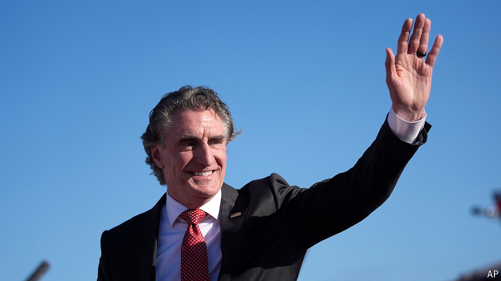

###### North Dakota rising

# Meet a leading Trump vice-presidential contender 

##### How Doug Burgum went from dark horse to favourite 

 

> Jul 8th 2024 

FEW CONSIDER North Dakota, home to just under 800,000 people, to be a political laboratory. Though a beautiful and pleasant place to raise a family, North Dakota lacks a tourist draw like South Dakota’s Mount Rushmore. And it was the only state that saw its population decline between 1930 and 2000, while America’s more than doubled in size. Yet the Peace Garden State has produced plenty of notable Americans. North Dakota’s hall of fame, a collection of portraits on the ground floor of the state’s 19-storey Art Deco capitol, honours authors, generals, Olympians, entertainers—and even some journalists. It also features the former CEO of Great Plains Software, Doug Burgum.

The 67-year-old from Arthur, a town of about 325 near the Minnesota border, was already famous by North Dakotan standards when he ran for governor in 2016. He has been the dominant figure in the state’s politics ever since. Few Americans, however, had heard of him when he announced a  in June 2023. His campaign focused on economic growth, energy production and national security—standard Republican fare. Yet to the surprise of many in Washington, Mr Burgum has emerged as  (alongside Senators J.D. Vance and Marco Rubio) to be selected as Mr Trump’s running-mate. Mr Trump has been teasing about the identity of his pick for months, but must end the sort-of-suspense when he accepts his party’s nomination next week in Milwaukee.

