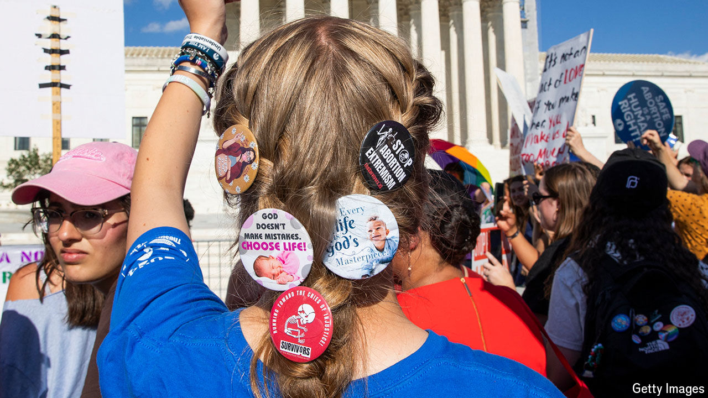

###### The party line

# The Republicans’ policy platform previews the coming campaign 

##### Social conservatives and fiscal hawks will be disappointed. Opponents of immigration will not 

 

> Jul 11th 2024 

While Donald Trump was relatively quiet in the days after his —preferring to let the president’s troubles fill the headlines—he still posted steadily on Truth Social. Amid notes criticising the media and sharing favourable polling, Mr Trump made some noticeable attempts to soften his message for a general-election audience. He distanced himself from a controversial group of former staffers preparing an agenda for his second term and emphasised the official 2024 Republican platform.

