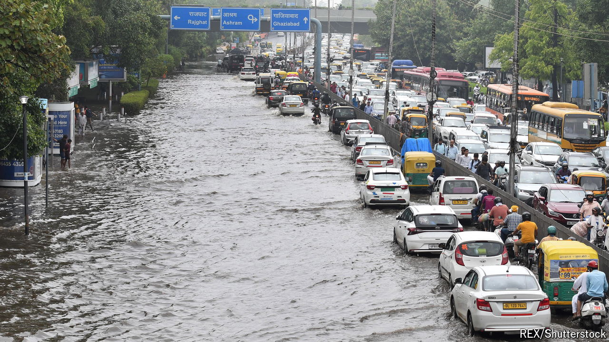

###### Too much and not enough

# Climate change is making the monsoon more dangerous 

##### People in South Asia and India can expect more extreme weather 

 

> Jul 18th 2024 

IN THE EARLY hours of June 28th your correspondent was woken by an almighty crash of thunder. The other side of the street had vanished behind a wall of water: the monsoon had arrived in Delhi. By the end of the day, 23cm of rain had fallen on India’s capital, three times more than it usually gets in the entire month of June, making it the rainiest 24 hours since 1966. The forecourt roof of a recently refurbished airport terminal collapsed, killing a taxi driver. Ten more people died in “rain-related incidents”.

