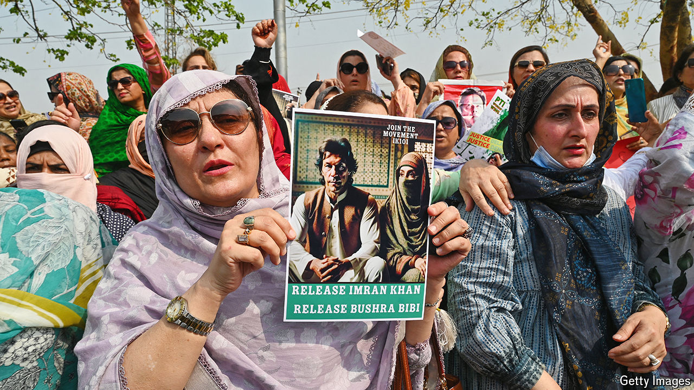

###### To ban or not to ban

# Imran Khan comes under further pressure in Pakistan 

##### The government and the generals who back it want to outlaw his party 

 

> Jul 18th 2024 

It is the oldest trope in Pakistani politics. On July 15th the government declared that Pakistan Tehreek-e-Insaf (PTI), the party of Imran Khan, a popular former prime minister who is currently in jail, is involved in “anti-state activities”. The allegations? That the PTI sabotaged negotiations with the International Monetary Fund (IMF) and hired an American lobbying firm. For good measure the government is also initiating high-treason proceedings against Mr Khan, a crime that attracts the death penalty. “Imran Khan and Pakistan cannot go together,” said Attaullah Tarar, the information minister. 

The harassment of the opposition suggests that the minority government of Shehbaz Sharif, the prime minister, is feeling the heat. On July 12th the Supreme Court returned the PTI to Parliament: the party had been barred from contesting the general election in February, forcing its candidates to run as independents. The Supreme Court also declared that the PTI is eligible for a share of parliamentary seats reserved for women and non-Muslims. This means that Mr Khan’s party looks set to become the largest in Parliament. More damagingly for Mr Sharif, his hopes of assembling a two-thirds majority, and with it the power to amend the constitution, appear to be over.

