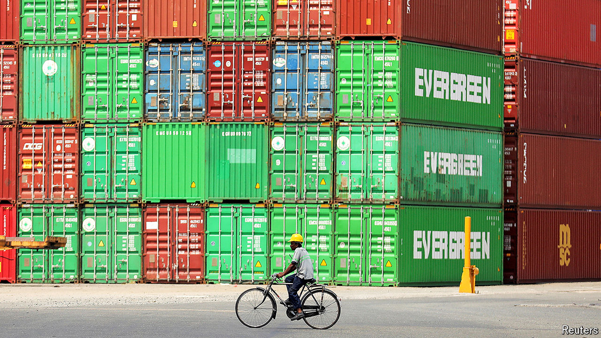

###### Bay of dreams

# The Bay of Bengal should be an economic superpower 

##### Why isn’t it? 

 

> Jul 18th 2024 

IT IS THE biggest bay on Earth—so big that five countries define the Bay of Bengal’s rim, among them India, the biggest country in the world by population, and Bangladesh, the eighth most populous. As such, the Bay of Bengal should be a natural and thriving economic space, binding South Asia and dynamic South-East Asia into one. But today it is a relative backwater. Ambitions are building to change that. 

