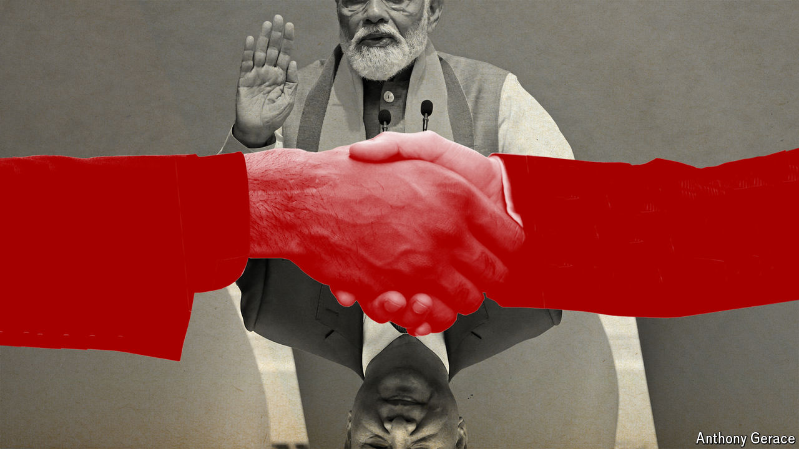

###### Indo-Chinese relations

# The epic bust-up between China and India could be ending 

##### Witness calm in the Himalayas, diplomatic charm offensives and thickening trade links 

 

> Jul 18th 2024 

Ask an Indian diplomat about relations with China and they will repeat a well-rehearsed mantra: there can be no return to normality until peace is restored on their disputed Himalayan border. That has been the official line for most of the time since 2020, when a deadly clash occurred there between Indian and Chinese troops. On the face of it, India’s stance is a rejection of China’s suggestion that the two countries should set aside the dispute, which has pushed India closer to America, and focus on areas of mutual interest. 

