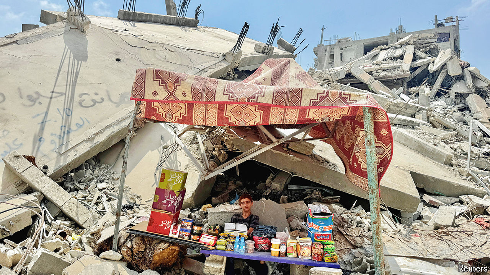

###### When the shooting stops

# Optimistic plans for post-war Gaza have little basis in reality 

##### Aid, policing, reconstruction—everything is even harder than it sounds 

 

> Jul 18th 2024 

AFTER ALMOST 300 days, planning for the end of the fighting in Gaza is beginning to seem otherworldly. Politicians and generals have been talking about what might happen when the shooting stops since the start of the war in October. Diplomats have spent months shuttling around the Middle East, trying to broker a ceasefire. Yet the moment has not come—and even if it does, the obstacles to lasting calm in Gaza are daunting.

