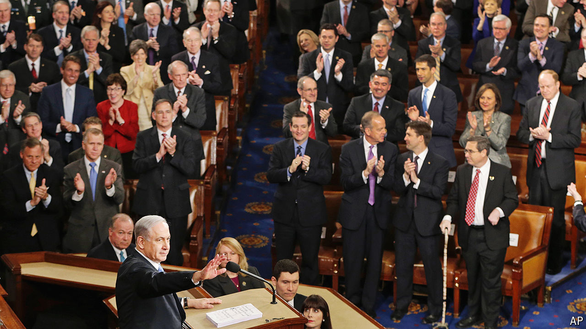

###### Glad-handing and grinding teeth

# Will Binyamin Netanyahu’s visit to America repair or weaken ties? 

##### He may damage relations with Israel’s indispensable protector 

 

> Jul 18th 2024 

RARELY HAS so divisive a figure been so honoured by America’s political class. On July 24th Binyamin “Bibi” Netanyahu, Israel’s prime minister, will deliver his fourth address to a joint session of Congress—more than any other foreign leader, including Winston Churchill.

It was as recently as March that Chuck Schumer, leader of the Democratic majority in the Senate, excoriated Mr Netanyahu as an “obstacle to peace” and called for new elections to remove him. The snub was all the sharper, given that Mr Schumer, Congress’s most prominent Jewish member, thinks of himself as a  or “protector” of Israel. Three months later the  yielded, joining other congressional leaders in inviting Mr Netanyahu to give his oration. “America’s relationship with Israel is ironclad and transcends one person or prime minister,” he explained. President Joe Biden, a friend to Israel but long exasperated by Mr Netanyahu, will receive him at the White House, too.

