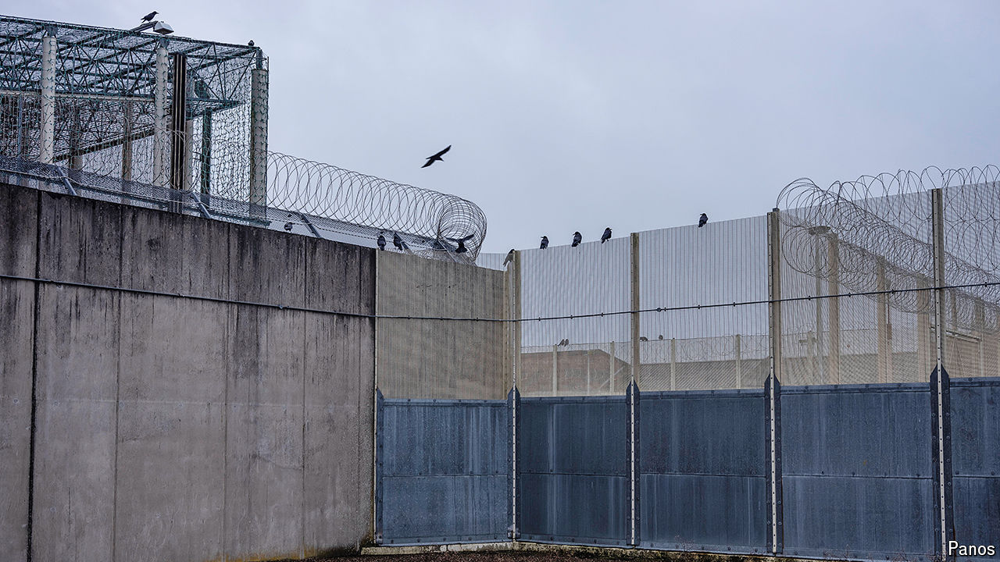

###### Cell signals

# A crisis in prisons gives Britain’s new government its first test 

##### Its response? Early releases, blaming Tories and hints at reform 

 

> Jul 18th 2024 

IT WAS NO coincidence that Shabana Mahmood chose HMP Bedford for her first visit as justice secretary on July 12th. In December Charlie Taylor, the chief inspector of prisons, reported that conditions at the Victorian-era facility were among the worst he’d ever seen: “On very wet days, raw sewage covered the floor and cells were dark, damp and dilapidated.” Violence was rife, staff out of their depth and the prison hopelessly overcrowded. 

The last of these problems has caused the first big headache of the new Labour government’s term in office. Britain’s prisons are full: space for new inmates is on course to run out within months, possibly weeks. Ms Mahmood warned that a lack of custody space would mean “vanloads of dangerous people circling the country”; police would be taken off the streets to manage overflow cells. The government’s short-term fix is to extend early releases, so some prisoners will be let out with less of their sentence completed. Its long-term plans are fuzzier and more intriguing. 

