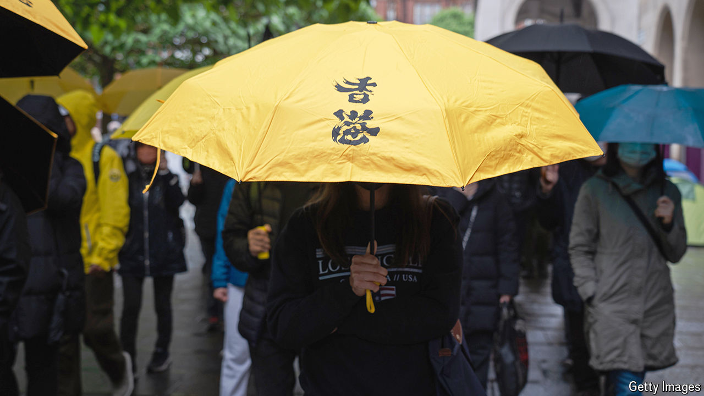

###### BNO visas

# Britain is a home but not a haven for Hong Kongers 

##### Life is not easy for a very distinctive group of immigrants 

 

> Jul 15th 2024 

WHEN ALEX Mak was asked to swear an oath of loyalty to Hong Kong’s government in 2020, he decided to leave. The 37-year-old civil servant had taken part in  the year before, when some 2m Hong Kongers had demonstrated against a proposed law enabling extradition to mainland China. Since then life in Hong Kong had become even more “suffocating”, he said. In 2021 he got his opportunity, and moved to Britain under a visa scheme opened to Hong Kongers that year. Like most of the 200,000 or so newcomers to have arrived under this scheme, he is highly educated and speaks excellent English. Yet integration has not been easy.

